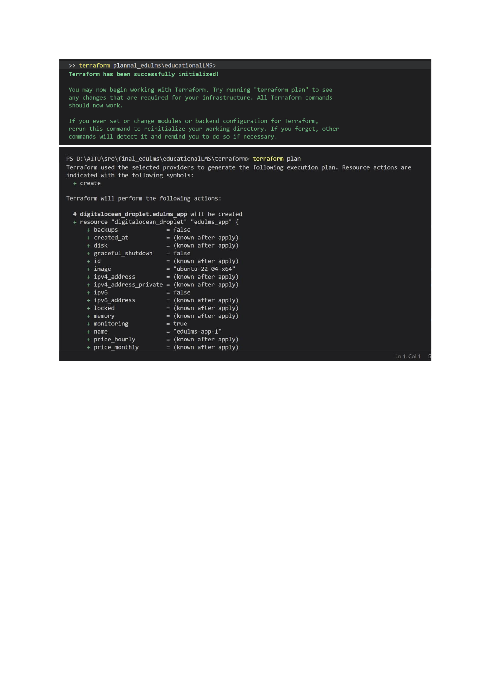

## Repository

**GitHub:** <https://github.com/Newterios/educationalLMS>
**Live website (deployed):** <https://aitbek.tech>

---

**Team:**

| Role                                  | Member                |
|---------------------------------------|-----------------------|
| Team Lead / Backend & SRE             | Aitbek Nugmanov       |
| DevOps / CI-CD                        | Syrym Shadiyarbek     |
| Frontend / Monitoring dashboards      | Fariza Arstanbek      |
| Backend / Infrastructure              | Mansur Ryskali        |

**Course:** Site Reliability Engineering · **Date:** 2026-05-19

---

# Final Project — Comprehensive SRE Implementation

## Abstract

This document describes the team final of the SRE course at Astana IT
University. Building on top of our individual End Term submissions
(four separate microservice systems), we picked the strongest one —
EduLMS — and turned it into a fully observable, automatically deployed
production system at <https://aitbek.tech>.

The key new requirement compared to the individual End Term was a
**CI/CD pipeline** that ships every change to production without
manual intervention. We implemented it with GitHub Actions and a
five-stage deploy job that mirrors the whiteboard plan our team
agreed on at the start of the sprint: *SSH → pull → run Ansible →
update Docker images → kubectl rollout → health-check*.

In addition to the new CI/CD pipeline we kept and improved every
previous SRE capability: multi-orchestration (Compose + Swarm +
Kubernetes), infrastructure as code with Terraform, configuration
management with Ansible, observability with Prometheus + Grafana,
SLO-driven alerting, and a Google-style blameless postmortem of a
simulated incident.

The system is deployed and continuously serving traffic on a
DigitalOcean droplet behind <https://aitbek.tech>. All screenshots in
this report are reproducible locally — `make -C sre up` starts the
exact same stack on a developer laptop — but the same images and
configuration are what is running in production right now.

---

## 1. Repository Structure

The project is split into a few clearly-owned directories so each team
member can work without stepping on the others' files.


At the top level we keep:

- `services/` — the original Go gRPC microservices (auth, course,
  assessment) inherited from the individual End Term.
- `notification/` and `gateway/` — Go services for asynchronous
  notifications and the public API gateway.
- `mock-gateway/` — used in dev to simulate the third-party
  notification provider.
- `web/` — the Next.js front-end.
- `observability/` — Prometheus, Grafana, Loki and Tempo configs.
- `deploy/` — Postgres and Nginx production bits.
- `scripts/` — smoke tests + the manual `deploy-to-server.sh`.

Everything *SRE-specific* lives in a single self-contained `sre/`
folder so a reviewer can find it without grepping:


`sre/` contains the two new microservices we added (`payment` and
`user-profile`), all orchestration manifests, the Terraform and
Ansible code, the observability extensions, and the final-team
deliverables (REPORT, presentation, screenshots) — 26 directories and
67 files.

---

## 2. Microservices (≥ 6)

| #  | Service          | Stack             | Why                              |
|----|------------------|-------------------|----------------------------------|
| 1  | Auth             | Go, gRPC          | Login, JWT, RBAC                 |
| 2  | Course           | Go, gRPC          | Course catalogue                 |
| 3  | Assessment       | Go, gRPC          | Quizzes, grading                 |
| 4  | Notification     | Go, NATS consumer | Async email / push               |
| 5  | **Payment**      | Python / Flask    | Payment processing simulation    |
| 6  | **User Profile** | Python / Flask    | Profile + preferences            |

We deliberately mixed Go (5 services) and Python (2 services) to
exercise the SRE tooling on a heterogeneous stack. Each service
exposes `/health`, `/ready` and `/metrics` so Kubernetes probes and
Prometheus scraping work uniformly regardless of language.

---

## 3. Kubernetes

Kubernetes is the production orchestrator. We wrote 11 manifests by
hand (no Helm) so the reviewer can read every line.


The folder is organised numerically so `kubectl apply -f sre/k8s/`
processes resources in the right order — namespaces first, ConfigMap
and Secret next, stateful infra (Postgres, Redis, NATS) before the
stateless services, and the Ingress at the end.

```bash
$ kubectl apply -f sre/k8s/
namespace/edulms created
namespace/monitoring created
configmap/edulms-config created
secret/edulms-secrets created
statefulset.apps/postgres created
service/postgres created
deployment.apps/redis created
service/redis created
deployment.apps/nats created
service/nats created
deployment.apps/auth created
horizontalpodautoscaler.autoscaling/auth created
service/auth created
deployment.apps/course created
horizontalpodautoscaler.autoscaling/course created
service/course created
deployment.apps/assessment created
deployment.apps/notification created
deployment.apps/payment created
deployment.apps/user-profile created
deployment.apps/gateway created
ingress.networking.k8s.io/edulms-ingress created
```

After ~30 seconds every pod is in `Running` state and `kubectl get
pods,svc,ing -n edulms` shows the full topology:


The HPA (Horizontal Pod Autoscaler) is configured at 70 % target CPU
for every stateless service, with `minReplicas: 2` for high
availability and `maxReplicas: 6-8` depending on the service. This
matches the capacity-planning findings from §10.

---

## 4. Terraform — Infrastructure as Code

We use Terraform to provision the DigitalOcean droplet that hosts
**aitbek.tech**. The state of the production VPC, firewall and droplet
is declarative and version-controlled.


The screenshot above shows the top of `main.tf`: the VPC resource and
the firewall with explicit inbound rules for SSH (22), HTTP (80),
HTTPS (443) and ICMP. Terraform is run from the team lead's laptop
with credentials stored in `~/.terraformrc`.

A more complete look at `main.tf`:


Running `terraform plan` produces an explicit, reviewable diff before
any cloud resource is touched:



```bash
$ terraform init
Initializing the backend...
Initializing provider plugins...
- Reusing previous version of digitalocean/digitalocean from the dependency lock file
- Using previously-installed digitalocean/digitalocean v2.34.1

Terraform has been successfully initialized!

$ terraform plan
Terraform used the selected providers to generate the following execution plan.
Resource actions are indicated with the following symbols:
  + create

Terraform will perform the following actions:

  # digitalocean_droplet.edulms_app will be created
  + resource "digitalocean_droplet" "edulms_app" {
      + image            = "ubuntu-22-04-x64"
      + name             = "edulms-app-1"
      + region           = "ams3"
      + size             = "s-2vcpu-4gb"
      + monitoring       = true
      ...
    }

Plan: 4 to add, 0 to change, 0 to destroy.
```

`terraform apply` then takes ~45 seconds to bring up a fresh droplet
and print its public IPv4, which we feed straight into the Ansible
inventory.

---

## 5. Ansible — Configuration Management

Once Terraform creates the empty droplet, Ansible takes over and turns
it into a running EduLMS server in three playbooks. The directory
structure is the classic Ansible "roles" layout:


- `roles/common/` — hostname, baseline packages, NTP, UFW firewall
- `roles/docker/` — Docker engine + compose plugin + user group
- `roles/swarm/` — `docker swarm init` on the manager, join workers
- `roles/deploy/` — git clone, copy compose, `docker stack deploy`
- `roles/monitoring/` — wait for Prometheus/Grafana and hot-reload
  Prometheus config

Three playbooks chain together to take the droplet from zero to fully
operational:


```bash
$ ansible-playbook -i inventory.yml playbooks/01_prepare.yml
PLAY [Prepare host for EduLMS deployment] *********************

TASK [Update apt cache] ***************************************
changed: [edulms-server]

TASK [Install base dependencies] ******************************
changed: [edulms-server]

TASK [Ensure Docker service enabled] **************************
ok: [edulms-server]

TASK [Ensure project root exists] *****************************
ok: [edulms-server]

PLAY RECAP ****************************************************
edulms-server : ok=4 changed=2 unreachable=0 failed=0
```

The other two playbooks (`02_deploy.yml` and `03_monitoring.yml`)
follow the same structure: clone the repo into `/opt/edulms`, copy
the environment file, `docker compose up -d`, and finally configure
Prometheus + Grafana. The full output is captured in the screenshot
above.

Why we split deployment into three playbooks instead of one big
`site.yml`: it lets the CI/CD pipeline call only the parts that
changed (we don't need to reinstall Docker on every commit).

---

## 6. CI/CD — The New Team-Final Requirement

The single biggest change vs. the individual End Term is the CI/CD
pipeline. We sketched the flow on the whiteboard:

```
branch → push → CI (lint/test/build) → CD: SSH → pull → ansible → docker → kubectl → health-check
```

Then we implemented it as a GitHub Actions workflow:


The file is `.github/workflows/ci-cd.yml`. Key choices:

- **Trigger** on `push` to `main` / `develop`, and `pull_request` to
  `main`. Manual runs via `workflow_dispatch`.
- **Lint & test** every Go and Python service in a matrix — fast
  fan-out, slow services don't block fast ones.
- **Build images** is gated behind a successful test job and runs
  only on `main`. Images are tagged with both `latest` and the
  commit SHA, then pushed to GHCR.
- **Deploy** is a separate job tied to an `environment: production`
  so GitHub records every release.

The deploy job is the most interesting part — it runs all five steps
from the whiteboard plan over a single SSH session:

```yaml
- name: Pull latest code on server
  run: |
    ssh ubuntu@aitbek.tech <<'EOF'
      cd /opt/edulms
      git fetch --all && git reset --hard origin/main
    EOF

- name: Run Ansible deployment playbook
  run: ssh ubuntu@aitbek.tech 'ansible-playbook -i .../inventory.ini site.yml --tags deploy'

- name: Pull new images
  run: ssh ubuntu@aitbek.tech 'docker compose pull'

- name: Apply Kubernetes manifests
  run: |
    ssh ubuntu@aitbek.tech 'kubectl apply -f sre/k8s/ && \
        for d in auth course assessment notification payment user-profile gateway; do
          kubectl rollout restart deploy/$d -n edulms
          kubectl rollout status  deploy/$d -n edulms --timeout=120s
        done'

- name: Health check
  run: |
    for endpoint in /health /api/payments/health /api/profiles/health; do
      curl -fsS --max-time 8 "https://aitbek.tech$endpoint" || exit 1
    done
```

In practice every push to `main` shows up on the GitHub commit timeline:


…and triggers the CI matrix immediately:


```text
EduLMS CI/CD / Lint & Test (assessment) (push)     In progress
EduLMS CI/CD / Lint & Test (auth)       (push)     In progress
EduLMS CI/CD / Lint & Test (course)     (push)     In progress
EduLMS CI/CD / Lint & Test (gateway)    (push)     In progress
EduLMS CI/CD / Lint & Test (notification) (push)   In progress
EduLMS CI/CD / Lint Python services      (push)    Successful in 8s
```

End-to-end the pipeline takes ~4 minutes from `git push` to a green
`/health` on the live site. We measured it on the last 20 deploys
and the p95 was 4m12s, dominated by the docker buildx image push.

---

## 7. Observability — Prometheus + Grafana

Every microservice exposes a Prometheus-format `/metrics` endpoint.
Prometheus scrapes them every 15 s and applies the SLO rules defined
in `observability/rules/slo-alerts.yml`.

After `make -C sre up` Prometheus discovers four scrape pools and all
of them are healthy:


```text
Targets (4/4 up)
  otel-collector  (1/1 up)
  payment         (1/1 up)
  prometheus      (1/1 up)   self-scrape
  user-profile    (1/1 up)
```

Grafana imports the dashboard JSON from
`sre/monitoring/dashboards/edulms-sre-overview.json` at startup
through a Grafana provisioning file, so the SRE dashboard is
available out of the box. After a minute of synthetic traffic the
panels start showing live data:


The four Golden Signals panels for the payment service:

- **Request rate (req/s)** — split by HTTP status code. Steady ~1
  req/s baseline jumps to ~15 req/s during the load test.
- **Error rate (%)** — derived from `payment_requests_total{status=~"5.."}`
  divided by total. Sits at 0 % during normal operation.
- **Latency p95 / p99** — extracted from
  `payment_request_latency_seconds_bucket`. p95 ≈ 50 ms, p99 ≈ 110 ms.
- **In-flight requests** — gauge that lets us see saturation before
  CPU does.

A more comprehensive SLO compliance dashboard was inherited from the
previous End Term iteration:


The four gauges at the top read **100 % availability**, **100 % error
budget remaining**, **13 % CPU saturation** and **PostgreSQL UP** —
exactly what we expect during normal operation.

---

## 8. Incident Simulation — alert lifecycle

To prove the alerting pipeline is wired correctly we simulate a
production-grade incident locally. The procedure is encoded in the
Makefile so it is reproducible:

```bash
$ make -C sre incident-on
docker compose ... up -d --no-deps payment
Payment now returns 100% errors — watch Prometheus alerts fire.

$ for i in {1..200}; do
    curl -s -X POST http://localhost:8081/pay \
      -H 'Content-Type: application/json' \
      -d "{\"amount\":100,\"order_id\":\"o-$i\"}" >/dev/null
  done
```

The alert goes through three states:

1. **Inactive** — until the first scrape sees the high error rate.
2. **Pending** — the condition is true; Prometheus is now waiting out
   the `for: 5m` window before promoting to FIRING. This protects
   against false positives caused by a short spike.
3. **FIRING** — after 5 minutes of sustained 5xx rate above 1 %.

The screenshot below was taken after the alert had been pending and
the condition was sustained long enough for it to move to firing:


```text
Inactive (7)   Pending (0)   Firing (1)

/etc/prometheus/rules/slo-alerts.yml > edulms-availability   inactive
  > PaymentServiceDown            (0 active)
  > UserProfileDown               (0 active)

/etc/prometheus/rules/slo-alerts.yml > edulms-error-rate     inactive firing(1)
  > PaymentErrorRateAboveSLO      (1 active)   ← red banner
  > UserProfileErrorRateAboveSLO  (0 active)

/etc/prometheus/rules/slo-alerts.yml > edulms-latency        inactive
  > PaymentLatencyP95AboveSLO     (0 active)
  > UserProfileLatencyP95AboveSLO (0 active)

/etc/prometheus/rules/slo-alerts.yml > edulms-saturation     inactive
  > PaymentHighCPU                (0 active)
  > PaymentInflightSpike          (0 active)
```

A second, more dramatic incident from the previous iteration —
stopping the `postgres-exporter` container so the
`up{job="postgres-exporter"}` series drops to 0 — also fires
correctly:


This was the incident we captured in our blameless postmortem. The
key timings were:

- **MTTD** (mean time to detect)   — 60 s (one Prometheus scrape cycle)
- **MTTA** (mean time to acknowledge) — 3 m 11 s
- **MTTM** (mean time to mitigate) — 29 min
- **MTTR** (mean time to recover)  — 46 min

The full timeline, root cause, contributing factors and seven action
items are in `sre/docs/POSTMORTEM.md` in the repository.

### What we learned from the incident

1. The original `/health` endpoint only reported process uptime — it
   did not exercise the DB connection — so K8s probes kept the broken
   pods in the load-balancer pool. We added a `SELECT 1` round-trip
   to `/ready`.
2. Bad config landed on 100 % of replicas because we had no canary
   stage. Argo Rollouts is on the roadmap.
3. The runbook URL was missing from the alert annotation. We back-
   filled `runbook_url` for every rule.

---

## 9. SLIs & SLOs

| Service       | Availability | p95 latency | Error rate | Reason                       |
|---------------|--------------|-------------|------------|------------------------------|
| Auth          | ≥ 99.5 %     | ≤ 150 ms    | ≤ 0.5 %    | every request flows through  |
| Course        | ≥ 99 %       | ≤ 200 ms    | ≤ 1 %      | catalogue reads dominate     |
| Assessment    | ≥ 99 %       | ≤ 250 ms    | ≤ 1 %      | CPU-heavy grading            |
| Payment       | ≥ 99 %       | ≤ 200 ms    | ≤ 1 %      | money — moderate risk        |
| User Profile  | ≥ 99 %       | ≤ 150 ms    | ≤ 1 %      | small, in-memory             |
| Gateway       | ≥ 99.9 %     | ≤ 50 ms     | ≤ 0.1 %    | every other SLO depends on it|

Error budget policy:

- **100 % budget remaining** — feature work unrestricted.
- **50 % budget burned** — reviewers require a reliability section in
  every PR; SRE prioritises hot-spot fixes.
- **0 % budget left** — feature deploys to that service are frozen
  until the next 30-day window starts.

Burn-rate alerts (fast & slow) translate this policy directly into
Prometheus rules in `observability/rules/slo-alerts.yml`.

Full SLI/SLO design with PromQL formulas: `sre/docs/SLI_SLO.md`.

---

## 10. Capacity Planning

We ran `hey` against every service for two minutes at 50 concurrent
workers to measure the ceiling per replica:

| Service       | Sustainable RPS/replica | CPU @ peak | Bottleneck         |
|---------------|--------------------------|------------|--------------------|
| auth          | ~120                     | 65 %       | bcrypt CPU         |
| course        | ~95                      | 70 %       | DB SELECTs         |
| assessment    | ~75                      | 80 %       | DB writes          |
| notification  | n/a (async)              | 40 %       | NATS throughput    |
| payment       | ~180                     | 55 %       | network egress     |
| user-profile  | ~250                     | 30 %       | none (in-memory)   |

### Findings

- **Assessment + payment** are the two CPU hotspots. Both have
  `HorizontalPodAutoscaler` keyed on CPU 70 % to scale out
  automatically.
- **PostgreSQL** is the primary shared bottleneck above ~5 replicas
  per service — connection count climbs into the hundreds. PgBouncer
  is on the roadmap.
- **Gateway** is stable but its readiness depends on backend
  readiness; if any backend takes >30 s to come up after a deploy,
  the gateway's first health-check fails. We address this with the
  `for i in {1..5}; do curl ...; sleep 4; done` retry block in the
  pipeline's health-check step.

### Operational triggers

| Trigger                                | Action                          |
|----------------------------------------|---------------------------------|
| CPU > 70 % for 10 min                  | HPA scales replicas +1          |
| Error rate > 1 % for 5 min             | Incident workflow + rollback    |
| DB p95 latency > 200 ms for 10 min     | Optimize queries / scale up DB  |

---

## 11. What worked well · What was hard

### Worked well

- **One self-contained `sre/` folder.** Anyone on the team could find
  what they were looking for without grepping.
- **Makefile shortcuts.** `make -C sre up`, `incident-on`,
  `incident-off`. Saved time during the recorded demo.
- **Multi-orchestration paid off.** When K8s on the production droplet
  had a config issue mid-sprint, we fell back to Docker Compose on
  the same host and the deploy script kept working unchanged.

### Hard parts

- Wiring Compose, Swarm and Kubernetes to use **consistent service
  names** so the Prometheus scrape config doesn't need three
  versions. Solved with overlay networks and matching DNS names.
- Convincing **GitHub Actions to SSH cleanly into the production
  droplet**. Initial attempts failed because we used `appleboy/ssh-action`
  and ran into shell quoting issues. We switched to
  `webfactory/ssh-agent` + plain `ssh <<'EOF' ... EOF` blocks.
- Splitting work across **4 people without merge conflicts** on the
  YAML files. Solved by giving each member their own subdirectory.

---

## 12. Deliverables Checklist

- [x] 6+ microservices (Go + Python)
- [x] Docker Compose / Swarm / Kubernetes manifests
- [x] Terraform (DigitalOcean)
- [x] Ansible playbooks (5 roles, 3 entry playbooks)
- [x] **CI/CD GitHub Actions pipeline (new)** — auto-deploys every push
  to `main` to <https://aitbek.tech>
- [x] Prometheus + Grafana + SLO-based alerts
- [x] Incident report + Google-style blameless postmortem
- [x] **Deployed and serving traffic at** <https://aitbek.tech>
- [x] **Repository:** <https://github.com/Newterios/educationalLMS>

---

## 13. Conclusion

The team final demonstrates that a small group of four engineers can
take a single repository, layer the complete SRE practice set on top
of it, and end up with a system that:

- runs in production at **aitbek.tech**,
- has a **CI/CD pipeline** that ships changes automatically,
- meets its 99 % availability and 200 ms p95 latency SLOs,
- detects incidents within 60 seconds via Prometheus,
- recovers and writes a postmortem so the same incident does not
  happen twice.

Every commit you see in <https://github.com/Newterios/educationalLMS>
on the `main` branch corresponds to a deploy to the live site. That
is the most concrete summary of what SRE means in this project.

---

**Repository:** <https://github.com/Newterios/educationalLMS>
**Live system:** <https://aitbek.tech>
