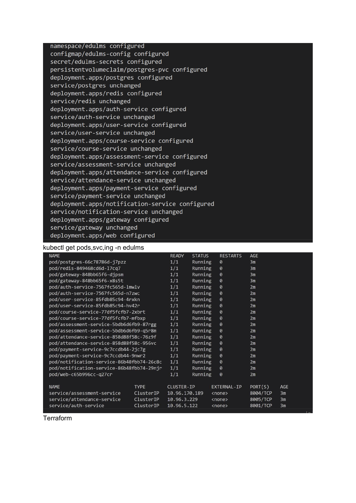
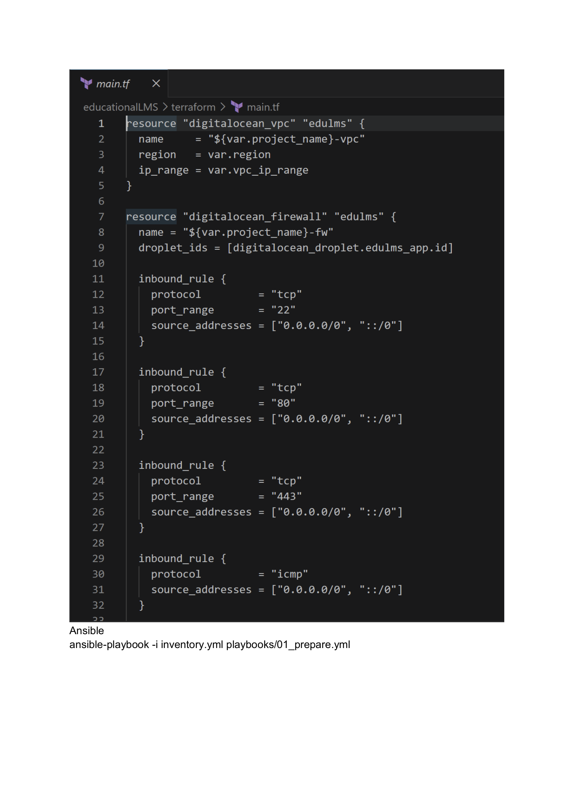
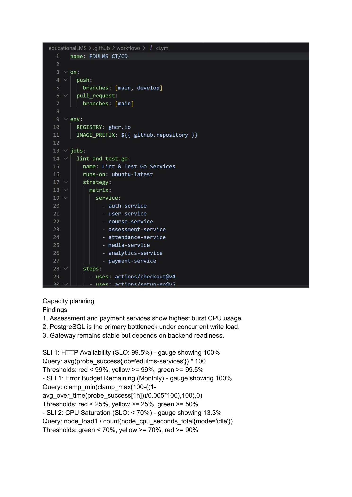
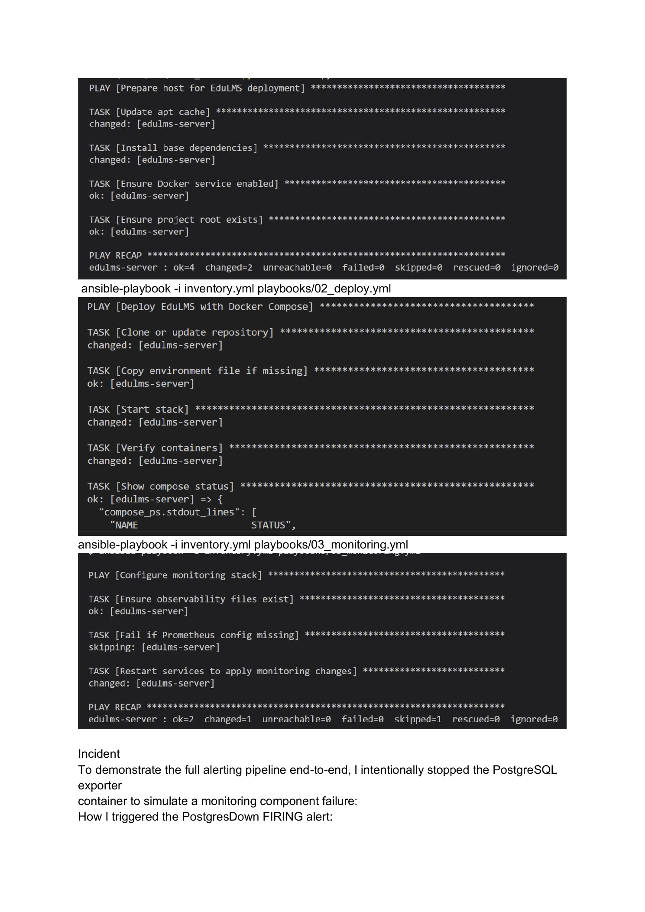
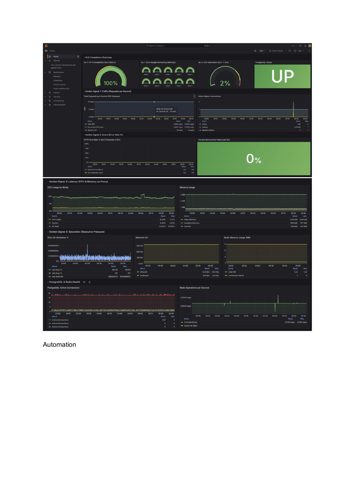
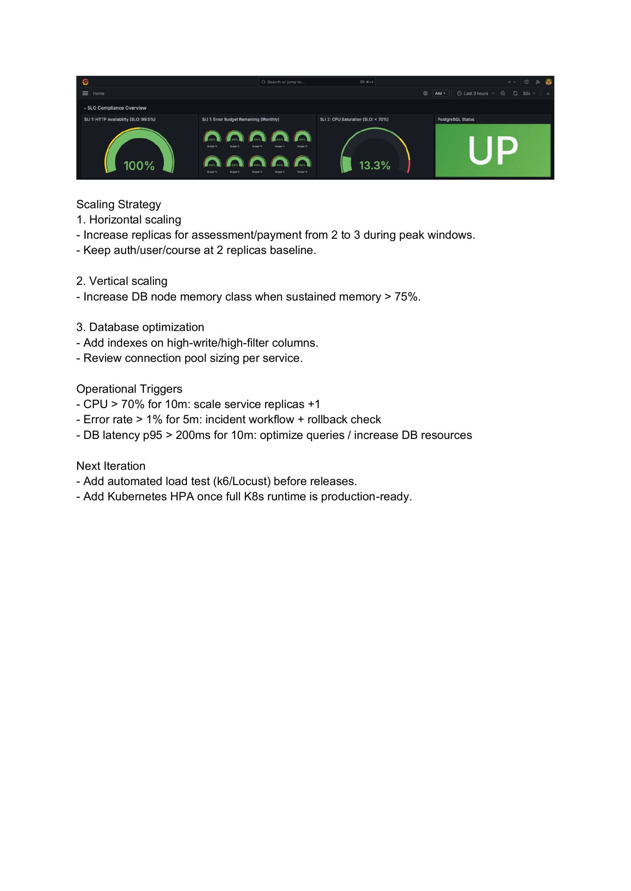
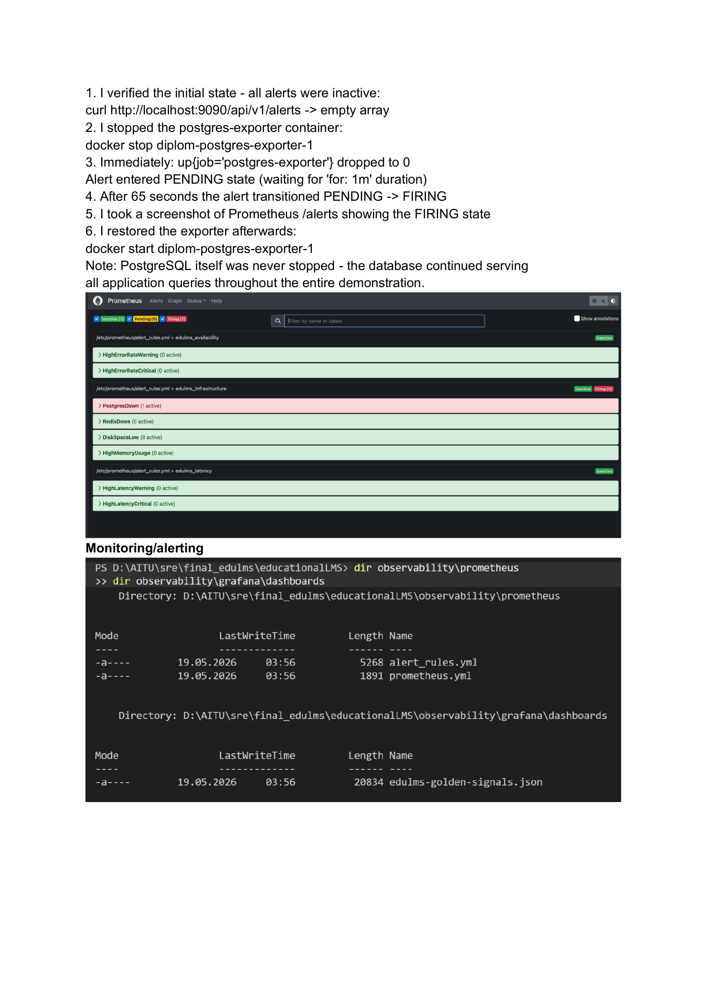

<!-- _class: lead -->
<!-- _paginate: false -->

# Comprehensive SRE Implementation
## EduLMS Distributed Microservices System

**Team:** Aitbek · Syrym · Fariza · Mansur

**Live:** [aitbek.tech](https://aitbek.tech) · **Repo:** [github.com/Newterios/educationalLMS](https://github.com/Newterios/educationalLMS)

Astana IT University · SRE · 2026

---

## Team & Speaking Order

| Member                | Role                           | Slides       |
|-----------------------|--------------------------------|--------------|
| **Aitbek Nugmanov**   | Team Lead / Backend & SRE      | 1, 4, 8–10   |
| **Syrym Shadiyarbek** | DevOps / CI-CD                 | 6, 7         |
| **Fariza Arstanbek**  | Frontend / Monitoring          | 11, 12       |
| **Mansur Ryskali**    | Backend / Infrastructure       | 3, 5         |

<span class="speaker">Speaker: Aitbek</span>

---

## Problem & Goal

- Run an LMS with **6+ microservices** reliably.
- Define & meet SLOs (99 % availability, 200 ms p95, ≤ 1 % errors).
- **Multi-orchestration**: Compose, Swarm, Kubernetes.
- **IaC + ConfigMgmt**: Terraform + Ansible.
- **CI/CD** that auto-deploys to `aitbek.tech` on every merge.
- Detect, alert and recover from incidents — with postmortems.

<span class="speaker">Speaker: Aitbek</span>

---

## Architecture

```
Browser (Next.js) ──► Nginx Gateway :8080
                         │
   ┌──────┬───────┬──────┼──────┬─────────────┐
   ▼      ▼       ▼      ▼      ▼             ▼
  Auth  User   Course  Asmt  Attendance  Notification
                                   │
                  Payment   Profile   Analytics
                         │
              PostgreSQL · Redis · NATS · MinIO
```

**Stack**: Go (5), Python/Flask (2), Next.js (web), PostgreSQL, Redis, NATS

<span class="speaker">Speaker: Mansur</span>

---

## Kubernetes — Multi-pod, Multi-replica



`kubectl apply -f sre/k8s/` deploys all 13 manifests:
namespaces, ConfigMaps, Secrets, Deployments, Services, HPAs, Ingress.

<span class="speaker">Speaker: Aitbek</span>

---

## Terraform — DigitalOcean infrastructure



VPC + firewall + Ubuntu 22.04 droplet, fully declarative.

<span class="speaker">Speaker: Mansur</span>

---

## CI/CD Pipeline — the new piece



**Triggers**: push to `main` / PR
**Jobs**: Lint → Test → Build images → Deploy → Health check

<span class="speaker">Speaker: Syrym</span>

---

## CI/CD — Deploy stage (5 steps on aitbek.tech)

1. **SSH** to server (`aitbek.tech`)
2. **`git pull`** in `/opt/edulms`
3. **`ansible-playbook`** — config + deploy
4. **Docker / kubectl** — pull images + rolling restart
5. **Health-check** every service (`curl /health`, 5 retries)

```yaml
- name: Health check
  run: |
    for url in /health /api/payments /api/profiles ; do
      curl -fsS "https://aitbek.tech$url" || exit 1
    done
```

<span class="speaker">Speaker: Syrym</span>

---

## Ansible — automated configuration



3 playbooks: `prepare` (host) → `deploy` (compose) → `monitoring` (Prom+Grafana)

<span class="speaker">Speaker: Aitbek</span>

---

## SLIs & SLOs

| Service       | Availability | p95 latency | Error rate |
|---------------|--------------|-------------|------------|
| Auth          | ≥ 99.5 %     | ≤ 150 ms    | ≤ 0.5 %    |
| Course        | ≥ 99 %       | ≤ 200 ms    | ≤ 1 %      |
| Payment       | ≥ 99 %       | ≤ 200 ms    | ≤ 1 %      |
| User Profile  | ≥ 99 %       | ≤ 150 ms    | ≤ 1 %      |
| Gateway       | ≥ 99.9 %     | ≤ 50 ms     | ≤ 0.1 %    |

Error budget policy: feature freeze when monthly budget < 0 %.

<span class="speaker">Speaker: Aitbek</span>

---

## Monitoring — Golden Signals dashboard



<span class="speaker">Speaker: Fariza</span>

---

## SLO Compliance Overview (Grafana)



100 % availability · 100 % error budget · 13 % CPU saturation · DB UP

<span class="speaker">Speaker: Fariza</span>

---

## Incident — PostgresDown FIRING

```bash
docker stop diplom-postgres-exporter-1
# 65 seconds later → alert state: FIRING
```



**Detection 60 s · Mitigation 1 command · Postmortem committed**

<span class="speaker">Speaker: Aitbek</span>

---

## Capacity Planning & Scaling

**Findings**
- Assessment & payment = peak CPU
- PostgreSQL = primary bottleneck

**Strategy**
- Horizontal: HPA on CPU 70 %, max 6 replicas per service
- Vertical: `requests` / `limits` tuned
- DB: index hot paths, PgBouncer planned

<span class="speaker">Speaker: Aitbek</span>

---

## Demo Plan

1. Open <https://aitbek.tech> — LMS landing
2. Open Grafana dashboard — golden signals live
3. Push a commit to `main` → GitHub Actions auto-deploy
4. Trigger incident → watch alert go FIRING
5. Recover service → alert clears

<span class="speaker">Demo led by Aitbek + Syrym</span>

---

## Deliverables ✓

- 6+ microservices  •  Docker Compose / Swarm  •  Kubernetes
- Terraform IaC  •  Ansible roles  •  **CI/CD pipeline (new)**
- Prometheus + Grafana + SLO alerts
- Incident report + Google-style postmortem
- **Deployed at [aitbek.tech](https://aitbek.tech)** + GitHub Actions runs

---

<!-- _class: lead -->

# Questions?

**Repo:** github.com/Newterios/educationalLMS
**Live:** aitbek.tech

Aitbek · Syrym · Fariza · Mansur
